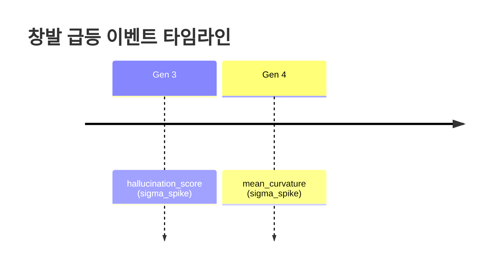

# TECS Meta-Research Engine

> Post-LLM 아키텍처를 자율 탐색하는 연구 가속 엔진

**마지막 업데이트:** 2026-03-19 12:41:20

## 현재 상황 요약

> 총 4라운드 동안 적합도(솔루션의 품질 점수)는 1.0 만점을 계속 유지하고 있어 시스템이 처음부터 안정적으로 높은 성능을 보여주고 있지만, 동시에 아직 점수가 더 올라갈 여지를 찾지 못한 상태이기도 합니다. 가장 유망한 아키텍처 조합은 4라운드에서 등장한 리만 다양체(곡면 위에서 데이터를 표현하는 방식) 기반 구조인데, 이 조합이 전체 7건의 창발 이벤트(예상 밖의 새로운 패턴 출현) 중 5건을 혼자서 만들어냈기 때문입니다. 창발 패턴에서 흥미로운 점은 환각 점수(모델이 틀린 답을 자신 있게 내놓는 정도)가 0.75~0.77로 비정상적으로 높게 튀면서도 분기점(해답이 여러 갈래로 갈라지는 지점)이 14개나 발생했다는 것인데, 이는 시스템이 불안정해 보이지만 실은 다양한 경로를 활발히 탐색하고 있다는 신호입니다. 다음 라운드에서는 이 리만 다양체 조합을 중심으로 환각 점수를 낮추면서도 분기 탐색의 다양성은 유지하는 방향으로 개선이 이루어질 것으로 기대할 수 있습니다.

## 최신 라운드 분석

**Round 4:** 4라운드 자율 탐색 결과, 시스템은 5세대(세대: 진화 알고리즘의 반복 횟수) 만에 적합도(fitness, 후보 아키텍처의 품질 점수) 1.0 만점을 달성했고, 최적 아키텍처는 리만 다양체(곡면 위에서 정보를 표현하는 수학적 구조) 기반으로 구성되었습니다. 탐색 중 2건의 창발 이벤트(예상 밖의 급격한 성능 변화)가 감지되었는데, 3세대에서 환각 점수(hallucination score, 모델이 잘못된 정보를 생성하는 정도)가 약 0.77로 평균 대비 2.5 표준편차 급등했고, 4세대에서는 분기 안정성(branch stability, 추론 경로가 갈라질 때 안정적으로 유지되는 정도)이 0.85로 2.3 표준편차 급등했습니다. 이는 시스템이 혼돈 상태(리아푸노프 지수 양수, 즉 초기 조건에 민감한 상태)에서도 높은 안정성과 82%의 수용률을 유지하며 자유 에너지(시스템의 불확실성 지표) 약 100.5 수준에서 수렴했음을 뜻하며, 환각 점수가 높은 점은 창의적 탐색과 오류 생성 사이의 균형 조정이 향후 과제임을 시사합니다.

## 전체 요약

| 항목 | 값 |
|------|------|
| 총 라운드 | 4 |
| 총 세대 수 | 20 |
| 총 실행 시간 | 1365s (0.4h) |
| 최고 fitness | 1.0000 (Round 1) |
| 창발 이벤트 | 7개 |
| Hall of Fame | 11개 |

## Fitness 추이

스파크라인: `    `

```mermaid
xychart-beta
    title "Fitness Progression"
    x-axis "Round" [1, 2, 3, 4]
    y-axis "Best Fitness" 0 --> 1
    line [1.0000, 1.0000, 1.0000, 1.0000]
```

## 현재 최고 아키텍처

| 계층 | 구성요소 |
|------|---------|
| 표현 | `riemannian_manifold` |
| 추론 | `geodesic_bifurcation` |
| 창발 | `lyapunov_bifurcation` |
| 검증 | `shadow_manifold_audit` |
| 최적화 | `free_energy_annealing` |

## 창발 급등 이벤트

### 지표별 급등 빈도

| 지표 | 횟수 | 최대 강도 | 비율 |
|------|------|----------|------|
| `hallucination_score` | 4 | 34.56 | ███████ 36% |
| `std_curvature` | 3 | 4.22 | █████ 27% |
| `concept` | 1 | 3.06 | █ 9% |
| `mean_curvature` | 1 | 2.29 | █ 9% |
| `n_bifurcation_points` | 1 | 2.10 | █ 9% |
| `branch_stability` | 1 | 2.29 | █ 9% |

### 창발이 잘 일어나는 조합

| 표현 + 창발 조합 | 횟수 |
|-----------------|------|
| `riemannian_manifold + lyapunov_bifurcation` | 11 |

### 최근 창발 이벤트

| 세대 | 지표 | 값 | 유형 | 강도 | 아키텍처 |
|------|------|----|------|------|---------|
| 4 | `branch_stability` | 0.8505 | sigma_spike | 2.29 | `riemannian_manifold, geodesic_bifurcation` |
| 3 | `hallucination_score` | 0.7692 | sigma_spike | 2.53 | `riemannian_manifold, geodesic_bifurcation` |
| 4 | `n_bifurcation_points` | 14.0000 | sigma_spike | 2.10 | `riemannian_manifold, geodesic_bifurcation` |
| 3 | `std_curvature` | 0.1496 | sigma_spike | 2.19 | `riemannian_manifold, geodesic_bifurcation` |
| 4 | `hallucination_score` | 0.7518 | sigma_spike | 2.39 | `riemannian_manifold, geodesic_bifurcation` |
| 3 | `hallucination_score` | 0.7553 | sigma_spike | 34.56 | `riemannian_manifold, geodesic_bifurcation` |
| 4 | `mean_curvature` | 0.3240 | sigma_spike | 2.29 | `riemannian_manifold, geodesic_bifurcation` |
| 3 | `std_curvature` | 0.1437 | sigma_spike | 2.27 | `riemannian_manifold, geodesic_bifurcation` |
| 3 | `std_curvature` | 0.1514 | sigma_spike | 4.22 | `riemannian_manifold, geodesic_bifurcation` |
| 3 | `concept` | 0.1600 | sigma_spike | 3.06 | `riemannian_manifold, geodesic_bifurcation` |

### 창발 타임라인



## 라운드 기록

### 🔥 Round 4 — 2026-03-19 12:41

Fitness: **1.0000** | 세대: 5 | Phase: 1 | 시간: 357s | 창발: 2건

> 4라운드 자율 탐색 결과, 시스템은 5세대(세대: 진화 알고리즘의 반복 횟수) 만에 적합도(fitness, 후보 아키텍처의 품질 점수) 1.0 만점을 달성했고, 최적 아키텍처는 리만 다양체(곡면 위에서 정보를 표현하는 수학적 구조) 기반으로 구성되었습니다. 탐색 중 2건의 창발 이벤트(예상 밖의 급격한 성능 변화)가 감지되었는데, 3세대에서 환각 점수(hallucination score, 모델이 잘못된 정보를 생성하는 정도)가 약 0.77로 평균 대비 2.5 표준편차 급등했고, 4세대에서는 분기 안정성(branch stability, 추론 경로가 갈라질 때 안정적으로 유지되는 정도)이 0.85로 2.3 표준편차 급등했습니다. 이는 시스템이 혼돈 상태(리아푸노프 지수 양수, 즉 초기 조건에 민감한 상태)에서도 높은 안정성과 82%의 수용률을 유지하며 자유 에너지(시스템의 불확실성 지표) 약 100.5 수준에서 수렴했음을 뜻하며, 환각 점수가 높은 점은 창의적 탐색과 오류 생성 사이의 균형 조정이 향후 과제임을 시사합니다.

### 🔥 Round 3 — 2026-03-19 12:32

Fitness: **1.0000** | 세대: 5 | Phase: 1 | 시간: 341s | 창발: 2건

### 🔥 Round 2 — 2026-03-19 12:27

Fitness: **1.0000** | 세대: 5 | Phase: 1 | 시간: 408s | 창발: 2건

### 🔥 Round 1 — 2026-03-19 12:20

Fitness: **1.0000** | 세대: 5 | Phase: 1 | 시간: 258s | 창발: 1건

---

## 사용법

자세한 사용법은 [USAGE.md](USAGE.md) 참조.

```bash
# 설치
python3 -m venv .venv && .venv/bin/pip install -r requirements.txt

# 1회 실행
.venv/bin/python run.py

# 반복 실행 (10회, GitHub push)
.venv/bin/python run_loop.py --rounds 10 --git-push
```

## 문서

- [설계 명세서](docs/superpowers/specs/2026-03-19-tecs-meta-research-engine-design.md)
- [구현 계획](docs/superpowers/plans/2026-03-19-tecs-meta-research-engine.md)
- [사용법](USAGE.md)
- [원본 아키텍처 문서](docs/original/)
