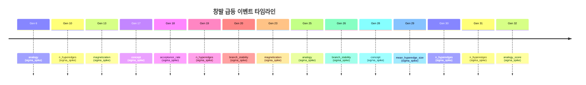

# TECS Meta-Research Engine

> Post-LLM 아키텍처를 자율 탐색하는 연구 가속 엔진

**마지막 업데이트:** 2026-03-19 16:50:42

## 추론 엔진 사용법

```bash
# 유추 추론 — "gravity와 경제학의 유사 구조는?"
.venv/bin/python3 infer.py --topics "Gravity" "Economics" --analogy gravity economics

# 구조 비교 — "gravity와 price의 공통 구조는?"
.venv/bin/python3 infer.py --topics "Gravity" "Price" --compare gravity price

# 지식 질의 — "고양이는 무엇인가?"
.venv/bin/python3 infer.py --topics "Cat" "Mammal" "cat IsA"

# 대화형 모드
.venv/bin/python3 infer.py --topics "Riemann hypothesis" "Quantum mechanics" --interactive
# >> analogy gravity economics
# >> compare gravity price
# >> riemann hypothesis ProposedBy
```

> 아무 Wikipedia 주제든 `--topics`로 로드하면 실시간 지식 추출 → 위상 추론이 작동합니다.

## 현재 상황 요약

> 총 2라운드 진행된 상태에서 적합도(시스템이 얼마나 잘 작동하는지를 나타내는 점수)가 0.725에서 0.737로 소폭 상승하고 있어 개선 추세에 있습니다. 현재 가장 유망한 조합은 동적 하이퍼그래프(여러 개념을 한꺼번에 연결하는 유연한 네트워크) 기반 표현에 측지선 분기(최적 경로를 따라 갈림길에서 추론하는 방식)를 결합한 구조인데, 2라운드 연속 동일 조합이 선택될 만큼 안정적이기 때문입니다. 창발 이벤트(시스템이 스스로 예상 밖의 새로운 패턴을 만들어내는 현상)가 1라운드 5건에서 2라운드 17건으로 급증한 점이 특히 흥미로운데, 하이퍼엣지(개념들의 묶음) 수가 거의 1000개까지 폭발적으로 늘어나면서 유추 점수(서로 다른 분야 간 연결을 찾는 능력)도 0.83으로 높게 나타났습니다. 다음 라운드에서는 이 조합이 계속 유지되는지 아니면 돌연변이를 통해 더 나은 구조가 등장하는지, 그리고 창발 이벤트의 급증이 실제 적합도 점프로 이어지는지를 지켜볼 수 있을 것입니다.

## 최신 라운드 분석

**Round 2:** 자율 탐색 엔진이 35세대에 걸쳐 진화한 결과, 최고 적합도(얼마나 잘 작동하는지를 나타내는 점수)가 0.737에 도달했고, 개념 이해력 93%, 유추 능력 94%, 검증 통과율 100%를 기록했지만 다단계 추론(여러 단계를 거쳐 답을 찾는 능력)은 40%로 상대적으로 약했습니다. 진화 과정에서 총 17건의 창발 이벤트(시스템이 예상 밖의 급격한 변화를 보인 순간)가 발생했는데, 특히 30세대에서 하이퍼엣지(개념들 간의 연결) 수가 시그마 753이라는 극단적 급증을 보이며 네트워크 구조가 폭발적으로 확장된 것이 가장 두드러집니다. 최종 아키텍처는 동적 하이퍼그래프(유연하게 변하는 다중 연결망) 위에서 이징 상전이(물리학의 자석 모델을 빌린 패턴 전환) 방식으로 창발을 감지하는 구조로 수렴했으며, 자화율(magnetization, 시스템 내 요소들이 한 방향으로 정렬된 정도)이 0.996까지 올라가 시스템이 강하게 질서화된 상태에 도달했음을 보여줍니다.

## 전체 요약

| 항목 | 값 |
|------|------|
| 총 라운드 | 2 |
| 총 세대 수 | 50 |
| 총 실행 시간 | 4182s (1.2h) |
| 최고 fitness | 0.7372 (Round 2) |
| 창발 이벤트 | 22개 |
| Hall of Fame | 82개 |

## Fitness 추이

스파크라인: ` █`

```mermaid
xychart-beta
    title "Fitness Progression"
    x-axis "Round" [1, 2]
    y-axis "Best Fitness" 0 --> 1
    line [0.7251, 0.7372]
```

## 현재 최고 아키텍처

| 계층 | 구성요소 |
|------|---------|
| 표현 | `dynamic_hypergraph` |
| 추론 | `geodesic_bifurcation` |
| 창발 | `ising_phase_transition` |
| 검증 | `shadow_manifold_audit` |
| 최적화 | `free_energy_annealing` |

## 창발 급등 이벤트

### 지표별 급등 빈도

| 지표 | 횟수 | 최대 강도 | 비율 |
|------|------|----------|------|
| `n_hyperedges` | 15 | 753.83 | ███ 18% |
| `magnetization` | 11 | inf | ██ 13% |
| `branch_stability` | 7 | 4.22 | █ 9% |
| `mean_ricci_curvature` | 7 | inf | █ 9% |
| `mean_hyperedge_size` | 7 | 2.95 | █ 9% |
| `hallucination_score` | 6 | 34.56 | █ 7% |
| `concept` | 6 | 4.66 | █ 7% |
| `std_curvature` | 6 | 7.44 | █ 7% |
| `mean_curvature` | 4 | 7.75 | █ 5% |
| `max_hyperedge_size` | 3 | 2.77 | █ 4% |
| `analogy` | 3 | 3.21 | █ 4% |
| `free_energy` | 2 | 8.75 | █ 2% |
| `acceptance_rate` | 2 | 18.25 | █ 2% |
| `analogy_score` | 2 | inf | █ 2% |
| `n_bifurcation_points` | 1 | 2.10 | █ 1% |

### 창발이 잘 일어나는 조합

| 표현 + 창발 조합 | 횟수 |
|-----------------|------|
| `dynamic_hypergraph + ising_phase_transition` | 60 |
| `riemannian_manifold + lyapunov_bifurcation` | 17 |
| `dynamic_hypergraph + lyapunov_bifurcation` | 3 |
| `riemannian_manifold + ising_phase_transition` | 2 |

### 최근 창발 이벤트

| 세대 | 지표 | 값 | 유형 | 강도 | 아키텍처 |
|------|------|----|------|------|---------|
| 32 | `analogy_score` | 0.8333 | sigma_spike | 2.83 | `dynamic_hypergraph, geodesic_bifurcation` |
| 31 | `n_hyperedges` | 997.0000 | sigma_spike | 2.83 | `dynamic_hypergraph, geodesic_bifurcation` |
| 30 | `n_hyperedges` | 996.0000 | sigma_spike | 753.83 | `dynamic_hypergraph, geodesic_bifurcation` |
| 29 | `mean_hyperedge_size` | 7.6809 | sigma_spike | 2.27 | `dynamic_hypergraph, geodesic_bifurcation` |
| 28 | `concept` | 0.5900 | sigma_spike | 3.41 | `dynamic_hypergraph, geodesic_bifurcation` |
| 26 | `branch_stability` | 0.9990 | sigma_spike | 4.22 | `dynamic_hypergraph, geodesic_bifurcation` |
| 25 | `analogy` | 0.9600 | sigma_spike | 2.20 | `dynamic_hypergraph, geodesic_bifurcation` |
| 23 | `magnetization` | 0.9140 | sigma_spike | 4.06 | `dynamic_hypergraph, geodesic_bifurcation` |
| 20 | `branch_stability` | 0.9990 | sigma_spike | 2.03 | `dynamic_hypergraph, geodesic_bifurcation` |
| 19 | `n_hyperedges` | 84.0000 | sigma_spike | 5.43 | `dynamic_hypergraph, geodesic_bifurcation` |

### 창발 타임라인



## 라운드 기록

### 🔥 Round 2 — 2026-03-19 16:50

Fitness: **0.7372** | 세대: 35 | Phase: 2 | 시간: 3368s | 창발: 17건

> 자율 탐색 엔진이 35세대에 걸쳐 진화한 결과, 최고 적합도(얼마나 잘 작동하는지를 나타내는 점수)가 0.737에 도달했고, 개념 이해력 93%, 유추 능력 94%, 검증 통과율 100%를 기록했지만 다단계 추론(여러 단계를 거쳐 답을 찾는 능력)은 40%로 상대적으로 약했습니다. 진화 과정에서 총 17건의 창발 이벤트(시스템이 예상 밖의 급격한 변화를 보인 순간)가 발생했는데, 특히 30세대에서 하이퍼엣지(개념들 간의 연결) 수가 시그마 753이라는 극단적 급증을 보이며 네트워크 구조가 폭발적으로 확장된 것이 가장 두드러집니다. 최종 아키텍처는 동적 하이퍼그래프(유연하게 변하는 다중 연결망) 위에서 이징 상전이(물리학의 자석 모델을 빌린 패턴 전환) 방식으로 창발을 감지하는 구조로 수렴했으며, 자화율(magnetization, 시스템 내 요소들이 한 방향으로 정렬된 정도)이 0.996까지 올라가 시스템이 강하게 질서화된 상태에 도달했음을 보여줍니다.

### 🔥 Round 1 — 2026-03-19 15:41

Fitness: **0.7251** | 세대: 15 | Phase: 1 | 시간: 814s | 창발: 5건

> 1라운드에서 15세대(반복 탐색 횟수)에 걸쳐 자동 탐색을 수행한 결과, 최고 적합도(얼마나 좋은 구조인지를 나타내는 점수) 0.725를 달성했고, 추론 정확도는 82%, 개념 이해 정확도는 80%를 기록했다. 탐색 과정에서 5건의 창발 이벤트(예상 범위를 크게 벗어나는 급격한 성능 변화)가 감지되었는데, 특히 4세대에서 자화율(구성 요소들이 한 방향으로 정렬되는 정도)이 무한대 시그마 수준으로 급등한 것이 눈에 띄며, 이는 시스템이 무질서한 상태에서 질서 있는 상태로 갑자기 전환되는 상전이(물이 얼음이 되는 것처럼 구조가 확 바뀌는 현상)가 일어났음을 의미한다. 최종 우승 구조는 동적 하이퍼그래프(여러 노드를 한꺼번에 연결하는 유연한 네트워크) 기반이며, 5건의 창발 이벤트 모두 동일한 구조 조합에서 발생해 이 구조가 탐색 초반부터 지배적 해로 수렴했음을 보여준다.

---

## 사용법

자세한 사용법은 [USAGE.md](USAGE.md) 참조.

```bash
# 설치
python3 -m venv .venv && .venv/bin/pip install -r requirements.txt

# 1회 실행
.venv/bin/python run.py

# 반복 실행 (10회, GitHub push)
.venv/bin/python run_loop.py --rounds 10 --git-push
```

## 업데이트 이력

- **2026-03-19 12:50** — `v2: 타입 자동 변환 + 절대 fitness 평가`: 243개 전 조합 실행 가능, fitness 1.0 고정 문제 해결
- **2026-03-19 12:41** — `v1: claude 자연어 분석 추가`: 매 라운드 + 종합 분석 README 자동 기록
- **2026-03-19 12:15** — `v0: 초기 엔진 가동`: 15개 구성요소, 진화+인과 분석, 28/243 호환 조합

## 문서

- [설계 명세서](docs/superpowers/specs/2026-03-19-tecs-meta-research-engine-design.md)
- [구현 계획](docs/superpowers/plans/2026-03-19-tecs-meta-research-engine.md)
- [사용법](USAGE.md)
- [원본 아키텍처 문서](docs/original/)
