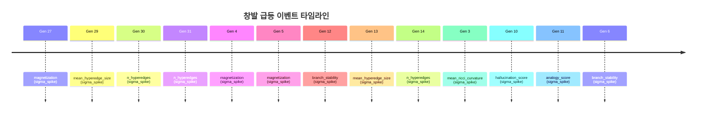

# TECS Meta-Research Engine

> Post-LLM 아키텍처를 자율 탐색하는 연구 가속 엔진

**마지막 업데이트:** 2026-03-19 15:54:02

## 추론 엔진 사용법

```bash
# 유추 추론 — "gravity와 경제학의 유사 구조는?"
.venv/bin/python3 infer.py --topics "Gravity" "Economics" --analogy gravity economics

# 구조 비교 — "gravity와 price의 공통 구조는?"
.venv/bin/python3 infer.py --topics "Gravity" "Price" --compare gravity price

# 지식 질의 — "고양이는 무엇인가?"
.venv/bin/python3 infer.py --topics "Cat" "Mammal" "cat IsA"

# 대화형 모드
.venv/bin/python3 infer.py --topics "Riemann hypothesis" "Quantum mechanics" --interactive
# >> analogy gravity economics
# >> compare gravity price
# >> riemann hypothesis ProposedBy
```

> 아무 Wikipedia 주제든 `--topics`로 로드하면 실시간 지식 추출 → 위상 추론이 작동합니다.

## 최신 라운드 분석

**Round 1:** 1라운드에서 15세대(반복 탐색 횟수)에 걸쳐 자동 탐색을 수행한 결과, 최고 적합도(얼마나 좋은 구조인지를 나타내는 점수) 0.725를 달성했고, 추론 정확도는 82%, 개념 이해 정확도는 80%를 기록했다. 탐색 과정에서 5건의 창발 이벤트(예상 범위를 크게 벗어나는 급격한 성능 변화)가 감지되었는데, 특히 4세대에서 자화율(구성 요소들이 한 방향으로 정렬되는 정도)이 무한대 시그마 수준으로 급등한 것이 눈에 띄며, 이는 시스템이 무질서한 상태에서 질서 있는 상태로 갑자기 전환되는 상전이(물이 얼음이 되는 것처럼 구조가 확 바뀌는 현상)가 일어났음을 의미한다. 최종 우승 구조는 동적 하이퍼그래프(여러 노드를 한꺼번에 연결하는 유연한 네트워크) 기반이며, 5건의 창발 이벤트 모두 동일한 구조 조합에서 발생해 이 구조가 탐색 초반부터 지배적 해로 수렴했음을 보여준다.

## 전체 요약

| 항목 | 값 |
|------|------|
| 총 라운드 | 1 |
| 총 세대 수 | 15 |
| 총 실행 시간 | 814s (0.2h) |
| 최고 fitness | 0.7251 (Round 1) |
| 창발 이벤트 | 5개 |
| Hall of Fame | 65개 |

## Fitness 추이

스파크라인: ` `

## 현재 최고 아키텍처

| 계층 | 구성요소 |
|------|---------|
| 표현 | `dynamic_hypergraph` |
| 추론 | `geodesic_bifurcation` |
| 창발 | `ising_phase_transition` |
| 검증 | `shadow_manifold_audit` |
| 최적화 | `free_energy_annealing` |

## 창발 급등 이벤트

### 지표별 급등 빈도

| 지표 | 횟수 | 최대 강도 | 비율 |
|------|------|----------|------|
| `n_hyperedges` | 11 | 358.33 | ███ 17% |
| `magnetization` | 9 | inf | ██ 14% |
| `hallucination_score` | 6 | 34.56 | █ 9% |
| `std_curvature` | 6 | 7.44 | █ 9% |
| `mean_ricci_curvature` | 6 | inf | █ 9% |
| `mean_hyperedge_size` | 6 | 2.95 | █ 9% |
| `branch_stability` | 5 | 3.79 | █ 8% |
| `concept` | 4 | 4.66 | █ 6% |
| `mean_curvature` | 4 | 7.75 | █ 6% |
| `max_hyperedge_size` | 3 | 2.77 | █ 5% |
| `free_energy` | 2 | 8.75 | █ 3% |
| `n_bifurcation_points` | 1 | 2.10 | █ 2% |
| `acceptance_rate` | 1 | 18.25 | █ 2% |
| `analogy_score` | 1 | inf | █ 2% |

### 창발이 잘 일어나는 조합

| 표현 + 창발 조합 | 횟수 |
|-----------------|------|
| `dynamic_hypergraph + ising_phase_transition` | 43 |
| `riemannian_manifold + lyapunov_bifurcation` | 17 |
| `dynamic_hypergraph + lyapunov_bifurcation` | 3 |
| `riemannian_manifold + ising_phase_transition` | 2 |

### 최근 창발 이벤트

| 세대 | 지표 | 값 | 유형 | 강도 | 아키텍처 |
|------|------|----|------|------|---------|
| 6 | `branch_stability` | 0.8658 | sigma_spike | 2.13 | `riemannian_manifold, geodesic_bifurcation` |
| 5 | `std_curvature` | 0.1606 | sigma_spike | 2.48 | `riemannian_manifold, geodesic_bifurcation` |
| 12 | `concept` | 0.5100 | sigma_spike | 4.66 | `dynamic_hypergraph, geodesic_bifurcation` |
| 11 | `analogy_score` | 0.8000 | sigma_spike | inf | `dynamic_hypergraph, geodesic_bifurcation` |
| 10 | `hallucination_score` | 0.6862 | sigma_spike | 2.21 | `dynamic_hypergraph, geodesic_bifurcation` |
| 3 | `mean_ricci_curvature` | 0.4229 | sigma_spike | inf | `dynamic_hypergraph, ricci_flow` |
| 14 | `n_hyperedges` | 97.0000 | sigma_spike | 2.41 | `dynamic_hypergraph, geodesic_bifurcation` |
| 13 | `mean_hyperedge_size` | 12.8261 | sigma_spike | 2.95 | `dynamic_hypergraph, geodesic_bifurcation` |
| 12 | `branch_stability` | 0.9990 | sigma_spike | 3.79 | `dynamic_hypergraph, geodesic_bifurcation` |
| 5 | `magnetization` | 0.9355 | sigma_spike | 2.11 | `dynamic_hypergraph, geodesic_bifurcation` |

### 창발 타임라인



## 라운드 기록

### 🔥 Round 1 — 2026-03-19 15:41

Fitness: **0.7251** | 세대: 15 | Phase: 1 | 시간: 814s | 창발: 5건

> 1라운드에서 15세대(반복 탐색 횟수)에 걸쳐 자동 탐색을 수행한 결과, 최고 적합도(얼마나 좋은 구조인지를 나타내는 점수) 0.725를 달성했고, 추론 정확도는 82%, 개념 이해 정확도는 80%를 기록했다. 탐색 과정에서 5건의 창발 이벤트(예상 범위를 크게 벗어나는 급격한 성능 변화)가 감지되었는데, 특히 4세대에서 자화율(구성 요소들이 한 방향으로 정렬되는 정도)이 무한대 시그마 수준으로 급등한 것이 눈에 띄며, 이는 시스템이 무질서한 상태에서 질서 있는 상태로 갑자기 전환되는 상전이(물이 얼음이 되는 것처럼 구조가 확 바뀌는 현상)가 일어났음을 의미한다. 최종 우승 구조는 동적 하이퍼그래프(여러 노드를 한꺼번에 연결하는 유연한 네트워크) 기반이며, 5건의 창발 이벤트 모두 동일한 구조 조합에서 발생해 이 구조가 탐색 초반부터 지배적 해로 수렴했음을 보여준다.

---

## 사용법

자세한 사용법은 [USAGE.md](USAGE.md) 참조.

```bash
# 설치
python3 -m venv .venv && .venv/bin/pip install -r requirements.txt

# 1회 실행
.venv/bin/python run.py

# 반복 실행 (10회, GitHub push)
.venv/bin/python run_loop.py --rounds 10 --git-push
```

## 업데이트 이력

- **2026-03-19 12:50** — `v2: 타입 자동 변환 + 절대 fitness 평가`: 243개 전 조합 실행 가능, fitness 1.0 고정 문제 해결
- **2026-03-19 12:41** — `v1: claude 자연어 분석 추가`: 매 라운드 + 종합 분석 README 자동 기록
- **2026-03-19 12:15** — `v0: 초기 엔진 가동`: 15개 구성요소, 진화+인과 분석, 28/243 호환 조합

## 문서

- [설계 명세서](docs/superpowers/specs/2026-03-19-tecs-meta-research-engine-design.md)
- [구현 계획](docs/superpowers/plans/2026-03-19-tecs-meta-research-engine.md)
- [사용법](USAGE.md)
- [원본 아키텍처 문서](docs/original/)
