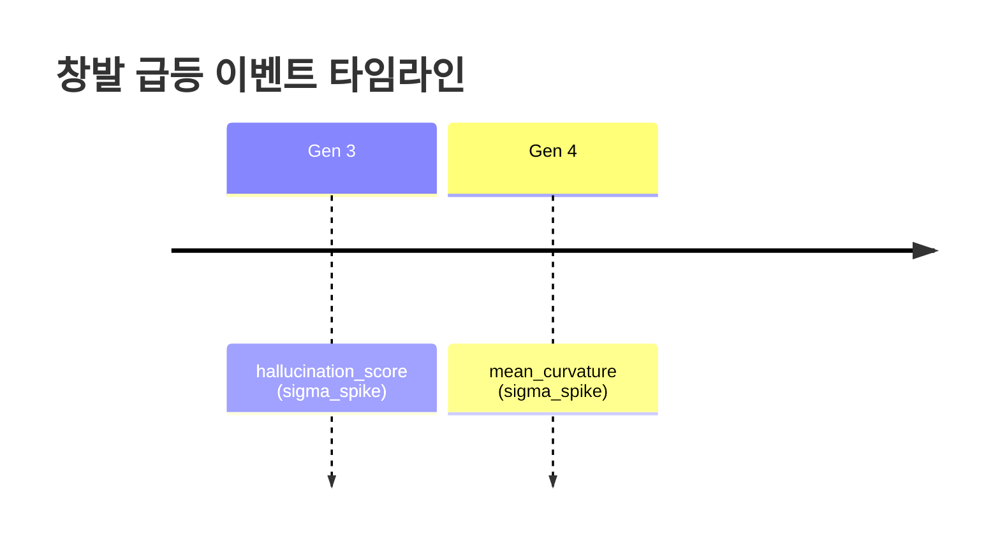

# TECS Meta-Research Engine

> Post-LLM 아키텍처를 자율 탐색하는 연구 가속 엔진

**마지막 업데이트:** 2026-03-19 12:32:50

## 전체 요약

| 항목 | 값 |
|------|------|
| 총 라운드 | 3 |
| 총 세대 수 | 15 |
| 총 실행 시간 | 1008s (0.3h) |
| 최고 fitness | 1.0000 (Round 1) |
| 창발 이벤트 | 5개 |
| Hall of Fame | 7개 |

## Fitness 추이

스파크라인: `   `

```mermaid
xychart-beta
    title "Fitness Progression"
    x-axis "Round" [1, 2, 3]
    y-axis "Best Fitness" 0 --> 1
    line [1.0000, 1.0000, 1.0000]
```

## 현재 최고 아키텍처

| 계층 | 구성요소 |
|------|---------|
| 표현 | `riemannian_manifold` |
| 추론 | `geodesic_bifurcation` |
| 창발 | `lyapunov_bifurcation` |
| 검증 | `shadow_manifold_audit` |
| 최적화 | `free_energy_annealing` |

## 창발 급등 이벤트

### 지표별 급등 빈도

| 지표 | 횟수 | 최대 강도 | 비율 |
|------|------|----------|------|
| `hallucination_score` | 3 | 34.56 | ████████ 43% |
| `std_curvature` | 2 | 4.22 | █████ 29% |
| `concept` | 1 | 3.06 | ██ 14% |
| `mean_curvature` | 1 | 2.29 | ██ 14% |

### 창발이 잘 일어나는 조합

| 표현 + 창발 조합 | 횟수 |
|-----------------|------|
| `riemannian_manifold + lyapunov_bifurcation` | 7 |

### 최근 창발 이벤트

| 세대 | 지표 | 값 | 유형 | 강도 | 아키텍처 |
|------|------|----|------|------|---------|
| 4 | `hallucination_score` | 0.7518 | sigma_spike | 2.39 | `riemannian_manifold, geodesic_bifurcation` |
| 3 | `hallucination_score` | 0.7553 | sigma_spike | 34.56 | `riemannian_manifold, geodesic_bifurcation` |
| 4 | `mean_curvature` | 0.3240 | sigma_spike | 2.29 | `riemannian_manifold, geodesic_bifurcation` |
| 3 | `std_curvature` | 0.1437 | sigma_spike | 2.27 | `riemannian_manifold, geodesic_bifurcation` |
| 3 | `std_curvature` | 0.1514 | sigma_spike | 4.22 | `riemannian_manifold, geodesic_bifurcation` |
| 3 | `concept` | 0.1600 | sigma_spike | 3.06 | `riemannian_manifold, geodesic_bifurcation` |
| 3 | `hallucination_score` | 0.7641 | sigma_spike | 3.55 | `riemannian_manifold, geodesic_bifurcation` |

### 창발 타임라인



## 라운드 기록

| Round | Fitness | 세대 | Phase | 시간 | 창발 | 날짜 |
|-------|---------|------|-------|------|------|------|
| 3 | 1.0000 | 5 | 1 | 341s | 🔥 2 | 2026-03-19 12:32 |
| 2 | 1.0000 | 5 | 1 | 408s | 🔥 2 | 2026-03-19 12:27 |
| 1 | 1.0000 | 5 | 1 | 258s | 🔥 1 | 2026-03-19 12:20 |

## 사용법

자세한 사용법은 [USAGE.md](USAGE.md) 참조.

```bash
# 설치
python3 -m venv .venv && .venv/bin/pip install -r requirements.txt

# 1회 실행
.venv/bin/python run.py

# 반복 실행 (10회, GitHub push)
.venv/bin/python run_loop.py --rounds 10 --git-push
```

## 문서

- [설계 명세서](docs/superpowers/specs/2026-03-19-tecs-meta-research-engine-design.md)
- [구현 계획](docs/superpowers/plans/2026-03-19-tecs-meta-research-engine.md)
- [사용법](USAGE.md)
- [원본 아키텍처 문서](docs/original/)
