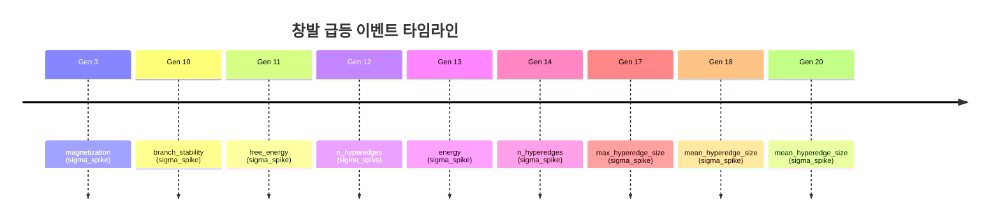

# TECS Meta-Research Engine

> Post-LLM 아키텍처를 자율 탐색하는 연구 가속 엔진

**마지막 업데이트:** 2026-03-19 18:44:17

## 추론 엔진 사용법

```bash
# 유추 추론 — "gravity와 경제학의 유사 구조는?"
.venv/bin/python3 infer.py --topics "Gravity" "Economics" --analogy gravity economics

# 구조 비교 — "gravity와 price의 공통 구조는?"
.venv/bin/python3 infer.py --topics "Gravity" "Price" --compare gravity price

# 지식 질의 — "고양이는 무엇인가?"
.venv/bin/python3 infer.py --topics "Cat" "Mammal" "cat IsA"

# 대화형 모드
.venv/bin/python3 infer.py --topics "Riemann hypothesis" "Quantum mechanics" --interactive
# >> analogy gravity economics
# >> compare gravity price
# >> riemann hypothesis ProposedBy
```

> 아무 Wikipedia 주제든 `--topics`로 로드하면 실시간 지식 추출 → 위상 추론이 작동합니다.

## 현재 상황 요약

> 아직 1라운드만 완료된 초기 단계이지만, 적합도(시스템이 얼마나 잘 작동하는지 나타내는 점수)가 0.718로 첫 시도치고 괜찮은 출발을 보이고 있고, 비교 대상이 없어 추세 판단은 이르지만 기반선이 확보된 상태이다. 현재 가장 유망한 조합은 동적 하이퍼그래프(여러 요소를 동시에 묶는 유연한 네트워크) 표현 + 측지 분기(최단 경로에서 갈라지는 추론) + 이징 상전이(물리학의 자석 모델을 빌린 창발 감지)인데, 이 조합이 유일하게 테스트된 것이면서도 9건의 창발 이벤트(시스템이 스스로 예상 밖의 패턴을 만들어낸 순간)를 발생시켜 활발한 자기조직화 징후를 보였기 때문이다. 특히 흥미로운 점은 에너지가 -1489까지 급락하는 시그마 스파이크(통계적으로 비정상적인 급변)가 나타난 것과, 하이퍼엣지(여러 노드를 한꺼번에 잇는 연결선)의 크기가 평균 8에서 11.5로 자발적으로 커진 것인데, 이는 시스템이 점점 더 큰 덩어리의 정보를 하나로 묶으려는 경향, 즉 추상화 수준의 자발적 상승을 보여준다. 다음 라운드들에서는 다른 아키텍처 조합들과 비교가 시작되면서 적합도 추세가 올라가는지 확인할 수 있고, 이 하이퍼엣지 성장 패턴이 지속되는지 여부가 이 접근법의 확장 가능성을 판가름하는 핵심 관전 포인트가 될 것이다.

## 최신 라운드 분석

**Round 1:** 21세대(세대 = 진화 반복 단위)에 걸쳐 탐색한 결과, 최고 적합도 0.718을 달성한 아키텍처는 동적 하이퍼그래프(노드들이 여러 개씩 묶이는 유연한 네트워크) 기반이며, 개념 이해 87%, 유추 능력 82%, 검증 통과율 100%를 기록했지만 다단계 추론 정확도는 40%로 상대적으로 낮았습니다. 총 9건의 창발 이벤트(시스템이 스스로 예상 밖의 급격한 변화를 보인 순간)가 감지되었는데, 특히 3세대에서 자화율(정렬 정도)이 1.0으로 무한대 시그마 스파이크를 일으키며 시스템이 한순간에 완전 정렬 상태로 전이한 것이 가장 두드러집니다. 이후 10~20세대 사이에 하이퍼엣지 수가 88→97개로 늘고 평균 연결 크기가 8→11.5로 커지는 등 네트워크가 점점 더 크고 촘촘하게 자기조직화하는 패턴이 관찰되었으며, 이는 시스템이 복잡성을 키우면서 안정성(branch stability 99.9%)을 유지하는 방향으로 진화했음을 의미합니다.

## 전체 요약

| 항목 | 값 |
|------|------|
| 총 라운드 | 1 |
| 총 세대 수 | 21 |
| 총 실행 시간 | 1376s (0.4h) |
| 최고 fitness | 0.7183 (Round 1) |
| 창발 이벤트 | 9개 |
| Hall of Fame | 9개 |

## Fitness 추이

스파크라인: ` `

## 현재 최고 아키텍처

| 계층 | 구성요소 |
|------|---------|
| 표현 | `dynamic_hypergraph` |
| 추론 | `geodesic_bifurcation` |
| 창발 | `ising_phase_transition` |
| 검증 | `shadow_manifold_audit` |
| 최적화 | `free_energy_annealing` |

## 창발 급등 이벤트

### 지표별 급등 빈도

| 지표 | 횟수 | 최대 강도 | 비율 |
|------|------|----------|------|
| `n_hyperedges` | 2 | 2.27 | ████ 22% |
| `mean_hyperedge_size` | 2 | 2.88 | ████ 22% |
| `magnetization` | 1 | inf | ██ 11% |
| `branch_stability` | 1 | 2.12 | ██ 11% |
| `free_energy` | 1 | 2.11 | ██ 11% |
| `energy` | 1 | 2.58 | ██ 11% |
| `max_hyperedge_size` | 1 | 2.25 | ██ 11% |

### 창발이 잘 일어나는 조합

| 표현 + 창발 조합 | 횟수 |
|-----------------|------|
| `dynamic_hypergraph + ising_phase_transition` | 9 |

### 최근 창발 이벤트

| 세대 | 지표 | 값 | 유형 | 강도 | 아키텍처 |
|------|------|----|------|------|---------|
| 20 | `mean_hyperedge_size` | 11.4944 | sigma_spike | 2.88 | `dynamic_hypergraph, geodesic_bifurcation` |
| 18 | `mean_hyperedge_size` | 8.0638 | sigma_spike | 2.72 | `dynamic_hypergraph, geodesic_bifurcation` |
| 17 | `max_hyperedge_size` | 25.0000 | sigma_spike | 2.25 | `dynamic_hypergraph, geodesic_bifurcation` |
| 14 | `n_hyperedges` | 97.0000 | sigma_spike | 2.27 | `dynamic_hypergraph, geodesic_bifurcation` |
| 13 | `energy` | -1489.0000 | sigma_spike | 2.58 | `dynamic_hypergraph, geodesic_bifurcation` |
| 12 | `n_hyperedges` | 88.0000 | sigma_spike | 2.05 | `dynamic_hypergraph, geodesic_bifurcation` |
| 11 | `free_energy` | 26.5341 | sigma_spike | 2.11 | `dynamic_hypergraph, geodesic_bifurcation` |
| 10 | `branch_stability` | 0.9990 | sigma_spike | 2.12 | `dynamic_hypergraph, geodesic_bifurcation` |
| 3 | `magnetization` | 1.0000 | sigma_spike | inf | `dynamic_hypergraph, geodesic_bifurcation` |

### 창발 타임라인



## 라운드 기록

### 🔥 Round 1 — 2026-03-19 18:44

Fitness: **0.7183** | 세대: 21 | Phase: 1 | 시간: 1376s | 창발: 9건

> 21세대(세대 = 진화 반복 단위)에 걸쳐 탐색한 결과, 최고 적합도 0.718을 달성한 아키텍처는 동적 하이퍼그래프(노드들이 여러 개씩 묶이는 유연한 네트워크) 기반이며, 개념 이해 87%, 유추 능력 82%, 검증 통과율 100%를 기록했지만 다단계 추론 정확도는 40%로 상대적으로 낮았습니다. 총 9건의 창발 이벤트(시스템이 스스로 예상 밖의 급격한 변화를 보인 순간)가 감지되었는데, 특히 3세대에서 자화율(정렬 정도)이 1.0으로 무한대 시그마 스파이크를 일으키며 시스템이 한순간에 완전 정렬 상태로 전이한 것이 가장 두드러집니다. 이후 10~20세대 사이에 하이퍼엣지 수가 88→97개로 늘고 평균 연결 크기가 8→11.5로 커지는 등 네트워크가 점점 더 크고 촘촘하게 자기조직화하는 패턴이 관찰되었으며, 이는 시스템이 복잡성을 키우면서 안정성(branch stability 99.9%)을 유지하는 방향으로 진화했음을 의미합니다.

---

## 사용법

자세한 사용법은 [USAGE.md](USAGE.md) 참조.

```bash
# 설치
python3 -m venv .venv && .venv/bin/pip install -r requirements.txt

# 1회 실행
.venv/bin/python run.py

# 반복 실행 (10회, GitHub push)
.venv/bin/python run_loop.py --rounds 10 --git-push
```

## 업데이트 이력

- **2026-03-19 12:50** — `v2: 타입 자동 변환 + 절대 fitness 평가`: 243개 전 조합 실행 가능, fitness 1.0 고정 문제 해결
- **2026-03-19 12:41** — `v1: claude 자연어 분석 추가`: 매 라운드 + 종합 분석 README 자동 기록
- **2026-03-19 12:15** — `v0: 초기 엔진 가동`: 15개 구성요소, 진화+인과 분석, 28/243 호환 조합

## 문서

- [설계 명세서](docs/superpowers/specs/2026-03-19-tecs-meta-research-engine-design.md)
- [구현 계획](docs/superpowers/plans/2026-03-19-tecs-meta-research-engine.md)
- [사용법](USAGE.md)
- [원본 아키텍처 문서](docs/original/)
